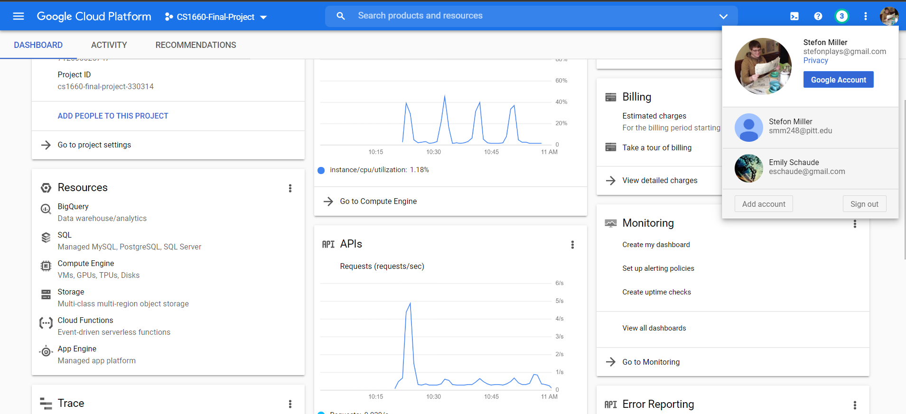
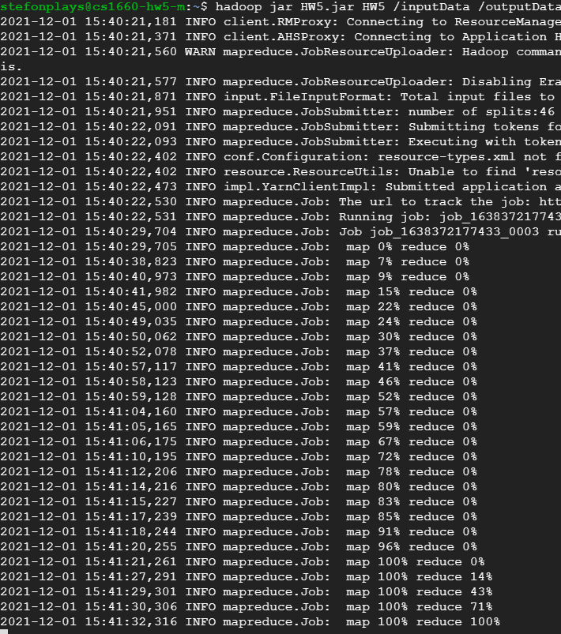
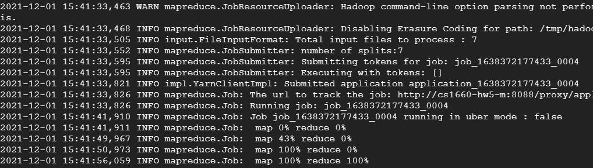

# CS1660-HW5
For this project, I implemented a mapreduce workflow that generates the wordcount of a group of input files and then gets the top N words by count. My mapreduce code uses 2 separate jobs, one to generate the wordcount for an input folder, and another to get the top N words from the output of the wordcount job. The program also assumes all files are in a folder and there are no subfolders. To do this, I took the input files from course project part 2 and extracted them all into a single folder

## Screenshot of GCP account

## Screenshot of wordcount job

## Screenshot of top N job

## Output file
The results of my mapreduce algorithm can be found in the `results.txt` file
